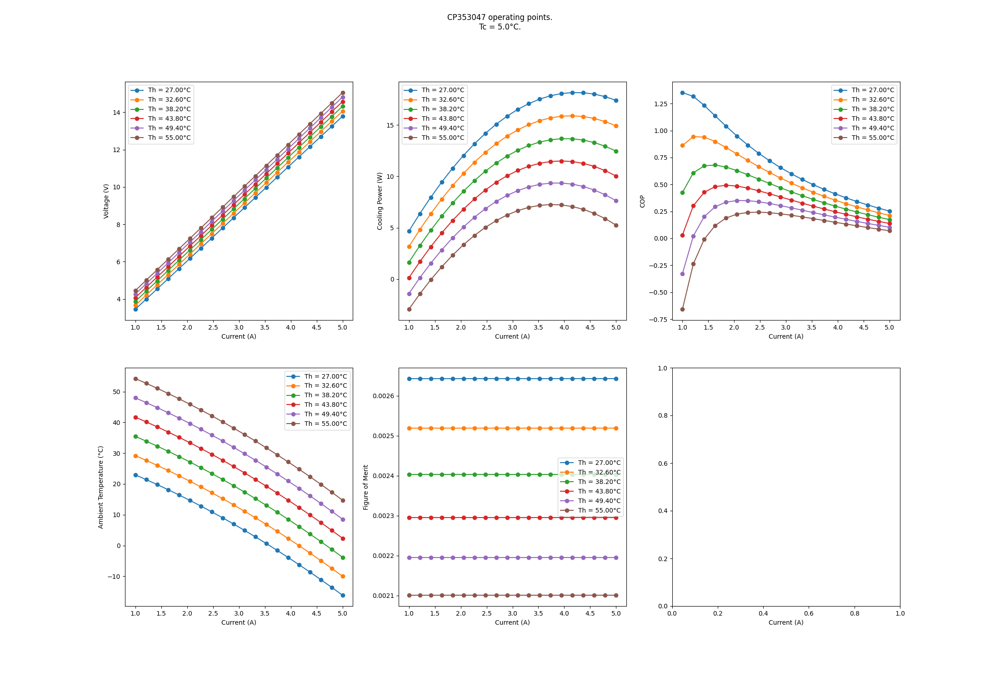

# tec_model
Module for calculating operating points of TEC modules.

Run `poetry run python src/script.py` to plot operating parameters of the CP353047 TEC device for now. Possibly more functionality coming later.

